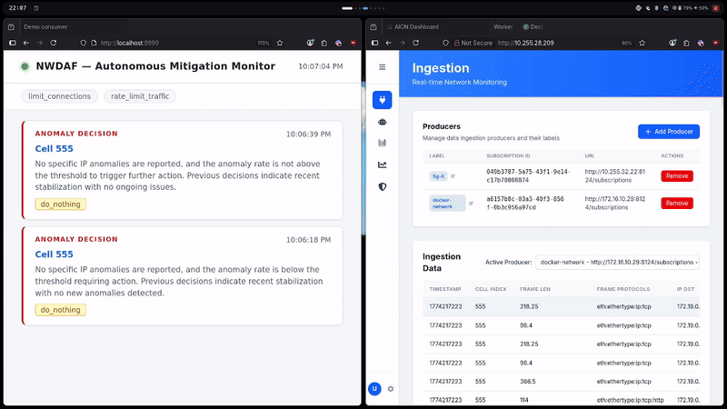

# traffic-sim

Docker-based infrastructure for simulating a Slowloris DDoS attack and demonstrating autonomous NWDAF mitigation.



## Components

| Component | Description |
|-----------|-------------|
| `controller` | Orchestrates the botnet. Registers workers, issues attack/normal commands via SSE |
| `worker` | Botnet node. Executes Slowloris attack or generates normal traffic on command |
| `victim` | Target HTTP server exposed at `172.19.0.100:8001` with resource limits to make it vulnerable |
| `callback_server.py` | NWDAF decision consumer. Receives notifications and applies iptables mitigations |

## Architecture

```
controller
├── worker x20  ──Slowloris──> victim (172.19.0.100)
└── ...

NWDAF (external)
└── Decision Service ──POST /notify──> callback_server ──iptables──> bridge interface
```

## Setup

### Requirements

- Docker + Docker Compose
- `br_netfilter` kernel module (required for iptables to see bridge traffic)
- `conntrack` and `iptables` on the host

```bash
sudo modprobe br_netfilter
```

### Start the simulation network

```bash
docker compose up -d --scale worker=20
```

### Get bridge interface
```bash
ip link show | grep $(docker network inspect sim-net --format '{{slice.ID 0 12}}') | grep ": br" | awk -F ':' '{print $2}'
```

### Start the callback server

```bash
sudo BRIDGE_INTERFACE=<bridge_iface> \
     CONTROLLER_URL=http://localhost:8000 \
     MITIGATION_DURATION=120 \
     uv run callback_server.py
```

The dashboard is available at `http://localhost:9999`.

### Show container ips

```bash
curl http://localhost:8000/status
```

### Start attack
**Using controller endpoint**
```bash
curl -X POST http://localhost:8000/ddos/<target_ip>
```
**Using Script**
```bash 
./ddos.sh <target_ip>
```

### Stopping attack

```bash
curl -X POST http://localhost:8000/normal
```


## Controller API

| Endpoint | Description |
|----------|-------------|
| `POST /ddos/{target_ip}` | Start Slowloris attack from all workers |
| `POST /normal` | Switch all workers to normal traffic |
| `POST /stop` | Stop all worker activity |
| `GET /status` | Show connected workers and their state |

## Callback Server API

| Endpoint | Description |
|----------|-------------|
| `GET /` | Live mitigation dashboard |
| `POST /notify` | Receive NWDAF decision notification |
| `DELETE /mitigations` | Clear all active mitigations |

## Environment Variables

### callback_server.py

| Variable | Default | Description |
|----------|---------|-------------|
| `BRIDGE_INTERFACE` | `br-6b9d61bf076a` | Docker bridge interface name |
| `CONTROLLER_URL` | `http://localhost:8000` | Traffic sim controller URL |
| `MITIGATION_DURATION` | `120` | Seconds before mitigation expires |
| `PORT` | `9999` | Callback server port |
